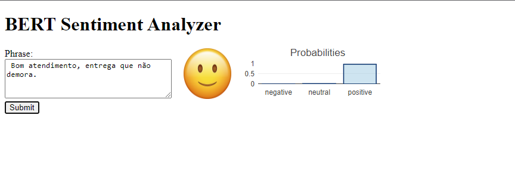

<div align="center">    
 
# TCC | UFPR 2023

## DESENVOLVIMENTO DE UMA INTERFACE DE PROGRAMAÇÃO DE APLICAÇÃO PARA ANÁLISE DE SENTIMENTOS BASEADA EM PROCESSAMENTO DE LINGUAGEM NATURAL E APRENDIZADO DE MÁQUINA

<p align="center">
    <a href="https://www.python.org/downloads/release/python-370/" title="python version"></a>
    <a href="https://github.com/cap-ntu/ML-Model-CI/actions" title="Build Status"></a>
    <a href="https://app.fossa.com/projects/custom%2B8170%2Fgithub.com%2Fcap-ntu%2FML-Model-CI?ref=badge_shield" title="FOSSA Status"></a>
    <a href="https://www.codacy.com?utm_source=github.com&amp;utm_medium=referral&amp;utm_content=cap-ntu/ML-Model-CI&amp;utm_campaign=Badge_Grade" title="Codacy Badge"></a>
    <a href="https://codebeat.co/a/yizheng-huang/projects/github-com-cap-ntu-ml-model-ci-master"></a>
    <a href="https://github.com/cap-ntu/ML-Model-CI/graphs/commit-activity" title="Maintenance"></a>
    <a href="https://gitter.im/ML-Model-CI/community?utm_source=badge&utm_medium=badge&utm_campaign=pr-badge" title="Gitter"></a>
</p> 

<!--  
Conference   
-->   
</div>
 
## Description   
Este projeto tem como objetivo desenvolver uma Interface de Programação de Aplicação (API) para análise de sentimentos com base em técnicas de Processamento de Linguagem Natural (PLN) e Aprendizado de Máquina (AM). A API permite aos usuários analisar o sentimento de textos, identificando se são positivos, negativos ou neutros. 

## How to run   
First, install dependencies   
```bash
# clone project   
git clone https://github.com/tccufpr2023/TCC.git 
```
[download B2W-Reviews01.csv](https://github.com/americanas-tech/b2w-reviews01)    
 
 Next, navigate to tcc-ufpr folder and run it.   
 ```bash
# module folder
cd tcc-ufpr

# run docker compose   
docker compose up    
```

## How to use
Inserira a frase na caixa de texto e click no botão submit.
<p float="left">
 
</p>

## Request and response
O backend API - REST responde as requisições na porta 8000 retornando um JSON no corpo da resposta:

```http
POST http://localhost:8000/predict
content-type: application/json

{
       "text": "O aplicativo é o pior que existe"
}

```
```json
{
	"probabilities": {
		"negative": 0.945719301700592,
		"neutral": 0.046569958329200745,
		"positive": 0.007710760459303856
	},
	"sentiment": "negative",
	"confidence": 0.945719301700592
}
```

## License

Este projeto está licenciado sob a [Licença MIT](LICENSE).

## Contact

Se você tiver alguma dúvida ou sugestão, sinta-se à vontade para entrar em contato:

- Nome: [sentiment analysis TCC-UFPR 2023]
- Email: [sentiment.analysis.tcc.ufpr2023@gmail.com]

### Citation   
```
@article{G. Thais N. Jeferson,
  title={DESENVOLVIMENTO DE UMA INTERFACE DE PROGRAMAÇÃO DE APLICAÇÃO PARA ANÁLISE DE SENTIMENTOS BASEADA EM PROCESSAMENTO DE LINGUAGEM NATURAL E APRENDIZADO DE MÁQUINA},
  author={GODOI Thais and NASCIMENTO Jeferson},
  journal={https://github.com/tccufpr2023/TCC.git)https://github.com/tccufpr2023/TCC.git},
  year={2023}
}
```   
